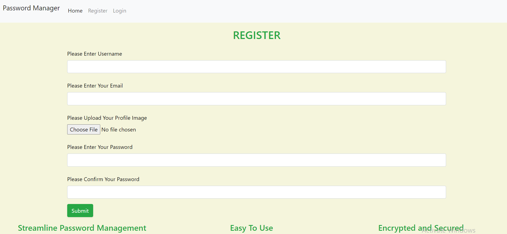
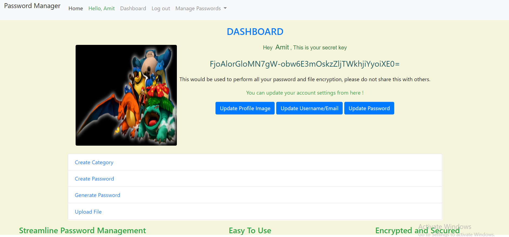
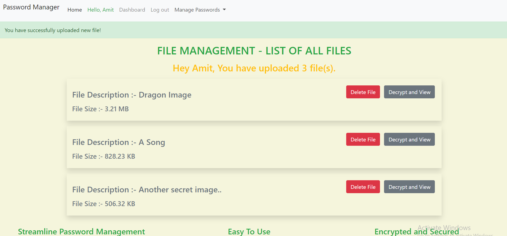
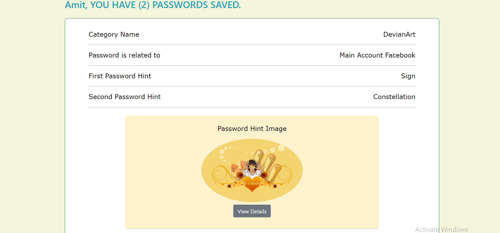
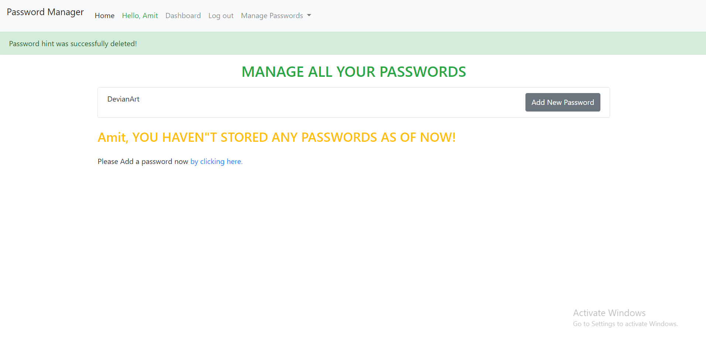
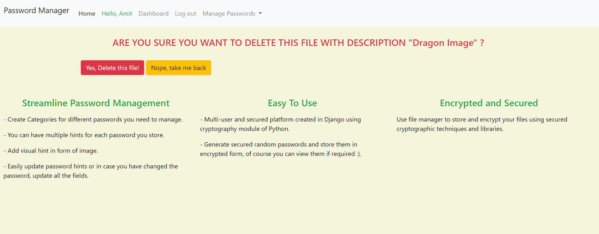
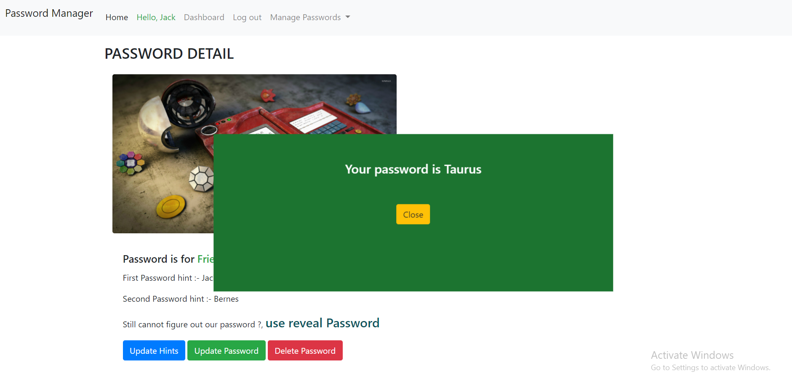

# A Multi-user password manager web application with ability to encrypt and store files.

A web based multi-user application which would facilitate users managing their passwords for multiple websites,
this applications allows them to store passwords in encrypted form with multiple hints. The application would initially
would have multiple hints stored for each password which would allow users to identify their passwords for various sites.

The password creation is categorized on the basis of what type it is, be it a bank account or website. There is a
miscellaneous category for ones which do not fall in either of the above two categories.

Users can also generate a random password based on level of security, a high level security would generate a 20 character
password with strong blend of block letters and numbers.

Users can also encrypt files and store them with a file description which would help them identify additional details about the
file. The file would be stored in encrypted form. Work on file decryption is still in progress.

## Getting Started

* Create a virtual environment, install all the python dependencies using requirements file.

* Configure database and other settings after activating virtual environment.

* Run database migrations, apply them and type in 'python manage.py runserver' and you're done.

* Please find the screenshots of the application attached below.

## Built With

* [Django](https://www.djangoproject.com/)
* [Bootstrap](https://getbootstrap.com/)
* [MySQL](https://www.mysql.com/)
* [HTML + CSS](https://www.w3schools.com/html/html_css.asp)

## Authors

* **Amit Prafulla (APFirebolt)** - (http://amitprafull.com/)

## License

This project is licensed under the MIT License - see the [LICENSE.md](LICENSE.md) file for details

## Screenshots

Please find some of the screenshots of the application. Register page where users would first land to use this app for the
very first time.

Dashboard page screenshot from where the user can create passwords, update account settings and perform more actions which
are core functions of the application.

File Upload page, it shows the size of the uploaded file and the file description.

Manage password page which shows the detail of the password, which account and category it belongs to along with the
associated hints to help users identify the password.

Another image of the password page where the user is yet to add any password, passwords cannot be created unless and until
user has at least one category.

File delete page screenshot. This application also has partially complete file management module where users can upload
file in encrypted form with some file description. Work on file decryption functionality is still in progress is hoped
to be completed soon.

If the user is unable to identify password, the real password in decrypted form would be displayed through a modal. Jquery
is used behind the scenes to achieve this functionality.

